<div align="center">

<!-- Animated Banner -->


<!-- Animated Logo Text -->
<br/>

```
╔══════════════════════════════════════════════════════════════╗
║                                                              ║
║    ░██████╗██╗░░░██╗██████╗░                                 ║
║    ██╔════╝╚██╗░██╔╝██╔══██╗                                 ║
║    ╚█████╗░░╚████╔╝░██████╦╝                                 ║
║    ░╚═══██╗░░╚██╔╝░░██╔══██╗                                 ║
║    ██████╔╝░░░██║░░░██████╦╝                                 ║
║    ╚═════╝░░░░╚═╝░░░╚═════╝░                                 ║
║                                                              ║
║         [ SYRIA BIT — سوريا بيت ]                            ║
║                                                              ║
╚══════════════════════════════════════════════════════════════╝
```

<br/>

<!-- Animated Typing Badge -->
[](https://git.io/typing-svg)

<br/>

<!-- Badges Row -->


<br/><br/>

</div>

---

<div align="center">

## ✨ من نحن | About Us

</div>

<table>
<tr>
<td width="50%">

```javascript
const SyriaBit = {
  name    : "Syria Bit",
  alias   : "SYB",
  mission : "بناء متاجر إلكترونية احترافية",
  vision  : "تمكين الأعمال الرقمية",
  phone   : "+212773963897",
  
  services: [
    "🛍️  متاجر إلكترونية متكاملة",
    "📱  تطبيقات موبايل للمتاجر",
    "🔐  بوابات دفع آمنة",
    "📊  لوحات تحكم ذكية",
    "🚀  تحسين الأداء والسرعة",
    "🌐  تصميم UI/UX احترافي",
  ],
  
  status  : "🟢 Ready to build your store!"
};
```

</td>
<td width="50%">

```python
class SYB:
    """
    ╔═══════════════════════════════╗
    ║    Syria Bit — SYB            ║
    ║    شريكك في النجاح الرقمي     ║
    ╚═══════════════════════════════╝
    """
    expertise = "E-Commerce Development"
    experience = "Full Stack Solutions"
    support = "24/7 Technical Support"
    
    values = {
        "quality"  : "★★★★★",
        "speed"    : "★★★★★",
        "security" : "★★★★★",
        "support"  : "★★★★★",
    }
    
    contact = "+212773963897"
```

</td>
</tr>
</table>

---

<div align="center">

## 🚀 خدماتنا | Our Services

</div>

<br/>

<div align="center">
<table>
<tr>

<td align="center" width="25%">

### 🛒
### متجر إلكتروني متكامل
**Full E-Commerce Store**

---
✅ واجهة مستخدم احترافية  
✅ نظام إدارة المنتجات  
✅ سلة تسوق متقدمة  
✅ نظام تتبع الطلبات  

</td>

<td align="center" width="25%">

### 💳
### بوابات الدفع
**Payment Gateways**

---
✅ دفع ببطاقة الائتمان  
✅ دفع إلكتروني آمن  
✅ تشفير SSL كامل  
✅ حماية من الاحتيال  

</td>

<td align="center" width="25%">

### 📊
### لوحة التحكم
**Smart Dashboard**

---
✅ إحصائيات مبيعات فورية  
✅ إدارة المخزون  
✅ تقارير تفصيلية  
✅ تحليل سلوك العملاء  

</td>

<td align="center" width="25%">

### 📱
### تطبيق الموبايل
**Mobile App**

---
✅ تطبيق iOS & Android  
✅ إشعارات فورية  
✅ تجربة مستخدم سلسة  
✅ وضع عمل بلا إنترنت  

</td>

</tr>
</table>
</div>

---

<div align="center">

## 🛠️ التقنيات | Tech Stack

</div>

<br/>

<div align="center">

### 🎨 Frontend


### ⚙️ Backend


### 🗄️ Database & Cloud


### 🔒 Security & DevOps


</div>

---

<div align="center">

## 📈 لماذا Syria Bit؟ | Why SYB?

</div>

```
┌─────────────────────────────────────────────────────────────────────────┐
│                                                                         │
│  ⚡ السرعة          ████████████████████  100%  — متاجر خفيفة وسريعة   │
│  🔐 الأمان          ████████████████████  100%  — حماية بيانات كاملة   │
│  🎨 التصميم         ████████████████████  100%  — واجهات عصرية جذابة   │
│  📱 الاستجابة       ████████████████████  100%  — متوافق مع كل الشاشات │
│  🛠️ الدعم الفني     ████████████████████  100%  — دعم على مدار الساعة  │
│  💰 التكلفة         █████████████░░░░░░░  65%   — أسعار تنافسية         │
│                                                                         │
└─────────────────────────────────────────────────────────────────────────┘
```

---

<div align="center">

## 🌟 مراحل بناء متجرك | Store Launch Process

```mermaid
flowchart LR
    A([📞 تواصل معنا]) -->|استشارة مجانية| B([📋 تحليل المتطلبات])
    B -->|خطة مخصصة| C([🎨 تصميم UI/UX])
    C -->|موافقتك| D([⚙️ التطوير])
    D -->|اختبارات شاملة| E([🔍 مراجعة الجودة])
    E -->|إطلاق| F([🚀 متجرك حي!])
    F -->|دعم مستمر| G([📊 تحليل ونمو])
    
    style A fill:#7c3aed,color:#fff
    style F fill:#10b981,color:#fff
    style G fill:#f59e0b,color:#fff
```

</div>



---

<div align="center">

## 💎 باقاتنا | Pricing Plans

</div>

<br/>

<div align="center">
<table>
<tr>

<td align="center" width="33%">

```
╔══════════════════════╗
║   🥉  STARTER        ║
║   ════════════════   ║
║   للمشاريع الصغيرة   ║
╠══════════════════════╣
║  ✅ متجر أساسي       ║
║  ✅ حتى 100 منتج     ║
║  ✅ لوحة تحكم بسيطة  ║
║  ✅ SSL مجاني         ║
║  ✅ دعم فني أساسي     ║
║  ❌ تطبيق موبايل      ║
╠══════════════════════╣
║  📞 +212773963897    ║
╚══════════════════════╝
```

</td>

<td align="center" width="33%">

```
╔══════════════════════╗
║  🥇  PROFESSIONAL   ║
║  ════════════════   ║
║  ⭐ الأكثر طلباً ⭐  ║
╠══════════════════════╣
║ ✅ متجر متكامل       ║
║ ✅ منتجات غير محدودة  ║
║ ✅ لوحة تحكم ذكية    ║
║ ✅ بوابة دفع متقدمة   ║
║ ✅ تحسين SEO          ║
║ ✅ دعم 24/7           ║
╠══════════════════════╣
║ 📞 +212773963897     ║
╚══════════════════════╝
```

</td>

<td align="center" width="33%">

```
╔══════════════════════╗
║  💎  ENTERPRISE      ║
║  ════════════════    ║
║  للمشاريع الكبيرة    ║
╠══════════════════════╣
║ ✅ كل مزايا PRO      ║
║ ✅ تطبيق iOS/Android  ║
║ ✅ API مخصص           ║
║ ✅ تكامل ERP          ║
║ ✅ مدير حساب خاص      ║
║ ✅ خادم مخصص          ║
╠══════════════════════╣
║ 📞 +212773963897     ║
╚══════════════════════╝
```

</td>

</tr>
</table>
</div>

---

<div align="center">

## 📞 تواصل معنا | Contact Us

<br/>


<br/><br/>

[](tel:+212773963897)
[](https://wa.me/212773963897)

<br/>

```
╔═══════════════════════════════════════════════════════╗
║                                                       ║
║   📱  الهاتف / WhatsApp : +212 77 396 3897            ║
║   🏢  الشركة            : Syria Bit (SYB)             ║
║   💼  التخصص            : متاجر إلكترونية احترافية    ║
║   ⏰  أوقات العمل       : 24/7 — نحن دائماً هنا       ║
║   🌍  نخدم              : جميع أنحاء العالم العربي    ║
║                                                       ║
╚═══════════════════════════════════════════════════════╝
```

<br/>

> **💡 هل أنت جاهز لبناء متجرك الإلكتروني الاحترافي؟**  
> **تواصل معنا اليوم واحصل على استشارة مجانية!**

<br/>

---


<br/>


</div>
