<div align="center">


<br/>

[](https://git.io/typing-svg)

<br/>


</div>

---

<div align="center">

```
╔══════════════════════════════════════════════════════════════════════════╗
║                                                                          ║
║   ░██████╗██╗░░░██╗██████╗░                                              ║
║   ██╔════╝╚██╗░██╔╝██╔══██╗                                              ║
║   ╚█████╗░░╚████╔╝░██████╦╝    ◈  SYRIA BIT  ·  سوريا بيت  ◈            ║
║   ░╚═══██╗░░╚██╔╝░░██╔══██╗    ─────────────────────────────────         ║
║   ██████╔╝░░░██║░░░██████╦╝    Digital Commerce Architecture              ║
║   ╚═════╝░░░░╚═╝░░░╚═════╝░    بناء المتاجر الإلكترونية الاحترافية       ║
║                                                                          ║
╚══════════════════════════════════════════════════════════════════════════╝
```

</div>

---

## ◈ ABOUT · من نحن

<table>
<tr>
<td width="50%" valign="top">

```typescript
const SyriaBit = {
  name     : "Syria Bit",
  alias    : "SYB",
  phone    : "+212 77 396 3897",

  mission  : "بناء متاجر إلكترونية احترافية",
  vision   : "تمكين الأعمال الرقمية",

  services : [
    "▸  Full E-Commerce Stores",
    "▸  Mobile Applications",
    "▸  Secure Payment Gateways",
    "▸  Smart Admin Dashboards",
    "▸  Performance Optimization",
    "▸  Professional UI/UX Design",
  ],

  status   : "[ ONLINE — Ready to build ]"
} as const;
```

</td>
<td width="50%" valign="top">

```python
class SyriaBit:
    """
    ╔═══════════════════════════════════╗
    ║  Syria Bit  ·  SYB                ║
    ║  شريكك في النجاح الرقمي           ║
    ╚═══════════════════════════════════╝
    """
    expertise  = "E-Commerce Architecture"
    stack      = "Full Stack Solutions"
    support    = "24 / 7 Technical Support"

    score = {
        "quality"    : "■■■■■  100%",
        "speed"      : "■■■■■  100%",
        "security"   : "■■■■■  100%",
        "support"    : "■■■■■  100%",
        "pricing"    : "■■■■░   85%",
    }

    contact = "+212 77 396 3897"
```

</td>
</tr>
</table>

---

## ◈ STATS · الأرقام

<br/>

<div align="center">

<table>
<tr>

<td align="center" width="33%">

```
╔═══════════════════╗
║                   ║
║      150+         ║
║   مشروع منجز      ║
║    PROJECTS       ║
║                   ║
╚═══════════════════╝
```

</td>

<td align="center" width="33%">

```
╔═══════════════════╗
║                   ║
║       99%         ║
║   رضا العملاء     ║
║  SATISFACTION     ║
║                   ║
╚═══════════════════╝
```

</td>

<td align="center" width="33%">

```
╔═══════════════════╗
║                   ║
║      24/7         ║
║    دعم فني        ║
║    SUPPORT        ║
║                   ║
╚═══════════════════╝
```

</td>

</tr>
</table>

</div>

---

## ◈ SERVICES · خدماتنا

<br/>

<div align="center">

<table>
<tr>

<td align="center" width="33%">


**متجر إلكتروني متكامل**
`Full E-Commerce`


</td>

<td align="center" width="33%">


**بوابات دفع آمنة**
`Payment Gateways`


</td>

<td align="center" width="33%">


**لوحة تحكم ذكية**
`Smart Dashboard`


</td>

</tr>
<tr>

<td align="center" width="33%">


**تطبيق موبايل**
`Mobile App`


</td>

<td align="center" width="33%">


**حماية وأمان**
`Security & SSL`


</td>

<td align="center" width="33%">


**أداء وسرعة**
`Performance`


</td>

</tr>
</table>

</div>

---

## ◈ TECH STACK · التقنيات

<br/>

<div align="center">

**[ FRONTEND ]**


**[ BACKEND ]**


**[ DATABASE & CLOUD ]**


**[ SECURITY & DEVOPS ]**


</div>

---

## ◈ PERFORMANCE · المؤشرات

```
┌──────────────────────────────────────────────────────────────────────────┐
│                                                                          │
│  METRIC              SCORE    BAR                          RATING        │
│  ─────────────────────────────────────────────────────────────────────  │
│                                                                          │
│  Speed               100 %    ██████████████████████████  PERFECT        │
│  Security            100 %    ██████████████████████████  PERFECT        │
│  UI Design           100 %    ██████████████████████████  PERFECT        │
│  Responsiveness      100 %    ██████████████████████████  PERFECT        │
│  Technical Support   100 %    ██████████████████████████  PERFECT        │
│  SEO Optimization     95 %    █████████████████████████░  EXCELLENT      │
│  Competitive Price    85 %    ██████████████████████░░░░  GREAT          │
│                                                                          │
└──────────────────────────────────────────────────────────────────────────┘
```

---

## ◈ WORKFLOW · مراحل العمل

```mermaid
flowchart LR
    A(["▸ تواصل معنا\nContact Us"]) -->|"Free Consultation"| B(["▸ تحليل المتطلبات\nRequirements"])
    B -->|"Custom Plan"| C(["▸ تصميم UI/UX\nDesign Phase"])
    C -->|"Your Approval"| D(["▸ التطوير\nDevelopment"])
    D -->|"Full QA Testing"| E(["▸ مراجعة الجودة\nQuality Review"])
    E -->|"Go Live"| F(["▸ إطلاق المتجر\nStore Launch"])
    F -->|"Continuous Support"| G(["▸ تحليل ونمو\nGrowth Analytics"])

    style A fill:#7c3aed,color:#fff,stroke:#7c3aed
    style C fill:#06b6d4,color:#fff,stroke:#06b6d4
    style F fill:#10b981,color:#fff,stroke:#10b981
    style G fill:#f59e0b,color:#000,stroke:#f59e0b
```



---

## ◈ PRICING PLANS · الباقات

<br/>

<div align="center">

<table>
<tr>

<td align="center" width="33%">

```
╔══════════════════════════╗
║                          ║
║      [ STARTER ]         ║
║   ══════════════════     ║
║   للمشاريع الصغيرة       ║
║                          ║
╠══════════════════════════╣
║                          ║
║  ◆ متجر أساسي            ║
║  ◆ حتى 100 منتج          ║
║  ◆ SSL مجاني              ║
║  ◆ دعم أساسي              ║
║  ✗ تطبيق موبايل           ║
║  ✗ API مخصص               ║
║                          ║
╠══════════════════════════╣
║  CONTACT: +212773963897  ║
╚══════════════════════════╝
```

</td>

<td align="center" width="33%">

```
╔══════════════════════════╗
║                          ║
║  [ PROFESSIONAL ] ★ HOT  ║
║  ════════════════════    ║
║     الأكثر طلباً         ║
║                          ║
╠══════════════════════════╣
║                          ║
║  ◆ متجر متكامل           ║
║  ◆ منتجات لا محدودة      ║
║  ◆ لوحة تحكم ذكية        ║
║  ◆ بوابة دفع متقدمة      ║
║  ◆ تحسين SEO              ║
║  ◆ دعم 24/7               ║
║                          ║
╠══════════════════════════╣
║  CONTACT: +212773963897  ║
╚══════════════════════════╝
```

</td>

<td align="center" width="33%">

```
╔══════════════════════════╗
║                          ║
║     [ ENTERPRISE ]       ║
║   ══════════════════     ║
║   للمشاريع الكبيرة       ║
║                          ║
╠══════════════════════════╣
║                          ║
║  ◆ كل مزايا PRO          ║
║  ◆ تطبيق iOS/Android     ║
║  ◆ API مخصص               ║
║  ◆ تكامل ERP              ║
║  ◆ مدير حساب خاص          ║
║  ◆ خادم مخصص              ║
║                          ║
╠══════════════════════════╣
║  CONTACT: +212773963897  ║
╚══════════════════════════╝
```

</td>

</tr>
</table>

</div>

---

## ◈ CONTACT · تواصل معنا

<br/>

<div align="center">


<br/><br/>

[](tel:+212773963897)
[](https://wa.me/212773963897)

<br/>

```
┌────────────────────────────────────────────────────────────────────┐
│                                                                    │
│   PHONE / WHATSAPP  ▸  +212 77 396 3897                           │
│   COMPANY           ▸  Syria Bit  (SYB)                           │
│   SPECIALIZATION    ▸  E-Commerce Architecture                    │
│   AVAILABILITY      ▸  24 / 7  —  Always Online                   │
│   COVERAGE          ▸  Arab World & International                 │
│                                                                    │
└────────────────────────────────────────────────────────────────────┘
```

<br/>

> **هل أنت جاهز لبناء متجرك الإلكتروني الاحترافي؟**
> **تواصل معنا اليوم واحصل على استشارة مجانية — Free Consultation**

<br/>


<br/><br/>


<br/>


</div>

